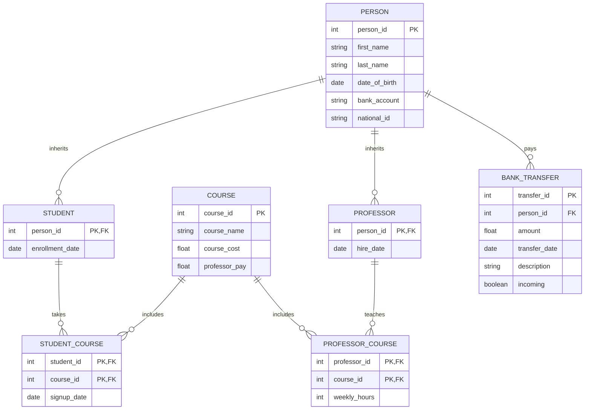

```mermaid
erDiagram
    COURSE {
        int course_id PK
        string course_name
        float course_cost
        float professor_pay
    }
    
    PERSON {
        int person_id PK
        string first_name
        string last_name
        date date_of_birth
        string bank_account
        string national_id
    }
    
    STUDENT {
        int person_id PK, FK
        date enrollment_date
    }
    
    PROFESSOR {
        int person_id PK, FK
        date hire_date
    }
    
    STUDENT_COURSE {
        int student_id PK, FK
        int course_id PK, FK
        date signup_date
    }
    
    BANK_TRANSFER {
        int transfer_id PK
        int person_id FK
        float amount
        date transfer_date
        string description
        boolean incoming
    }
    
    PROFESSOR_COURSE {
        int professor_id PK, FK
        int course_id PK, FK
        int weekly_hours
    }

    PERSON ||--o{ STUDENT: inherits
    PERSON ||--o{ PROFESSOR: inherits
    PERSON ||--o{ BANK_TRANSFER: pays
    STUDENT ||--o{ STUDENT_COURSE: takes
    COURSE ||--o{ STUDENT_COURSE: includes
    COURSE ||--o{ PROFESSOR_COURSE: includes
    PROFESSOR ||--o{ PROFESSOR_COURSE: teaches
```
