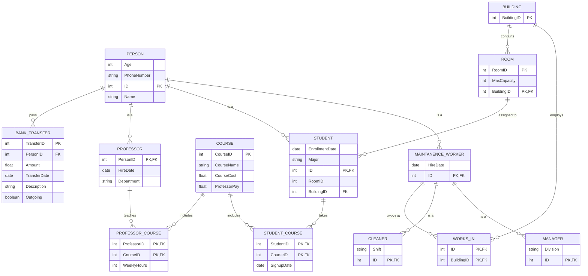

```mermaid
erDiagram
    PERSON {
        int Age
        string PhoneNumber
        int ID PK
        string Name
    }

    BUILDING {
        int BuildingID PK
    }

    ROOM {
        int RoomID PK
        int MaxCapacity
        int BuildingID PK, FK
    }

    MAINTANENCE_WORKER {
        date HireDate
        int ID PK, FK
    }

    STUDENT {
        date EnrollmentDate
        string Major
        int ID PK, FK
        int RoomID
        int BuildingID FK
    }

    MANAGER {
        string Division
        int ID PK, FK
    }

    CLEANER {
        string Shift
        int ID PK, FK
    }

    WORKS_IN {
        int ID PK, FK
        int BuildingID PK, FK
    }

    COURSE {
        int CourseID PK
        string CourseName
        float CourseCost
        float ProfessorPay
    }
    
    STUDENT_COURSE {
        int StudentID PK, FK
        int CourseID PK, FK
        date SignupDate
    }
    
    BANK_TRANSFER {
        int TransferID PK
        int PersonID FK
        float Amount
        date TransferDate
        string Description
        boolean Outgoing
    }
    
    PROFESSOR {
        int PersonID PK, FK
        date HireDate
        string Department
    }
    
    PROFESSOR_COURSE {
        int ProfessorID PK, FK
        int CourseID PK, FK
        int WeeklyHours
    }

    PERSON ||--o{ MAINTANENCE_WORKER: "is a"
    PERSON ||--o{ STUDENT: "is a"
    PERSON ||--o{ PROFESSOR: "is a"
    PERSON ||--o{ BANK_TRANSFER: "pays"
    MAINTANENCE_WORKER ||--o{ MANAGER: "is a"
    MAINTANENCE_WORKER ||--o{ CLEANER: "is a"
    BUILDING ||--o{ WORKS_IN: "employs"
    STUDENT ||--o{ STUDENT_COURSE: "takes"
    COURSE ||--o{ STUDENT_COURSE: "includes"
    COURSE ||--o{ PROFESSOR_COURSE: "includes"
    PROFESSOR ||--o{ PROFESSOR_COURSE: "teaches"
    MAINTANENCE_WORKER ||--o{ WORKS_IN: "works in"
    BUILDING ||--o{ ROOM: "contains"
    ROOM ||--o{ STUDENT: "assigned to"
```